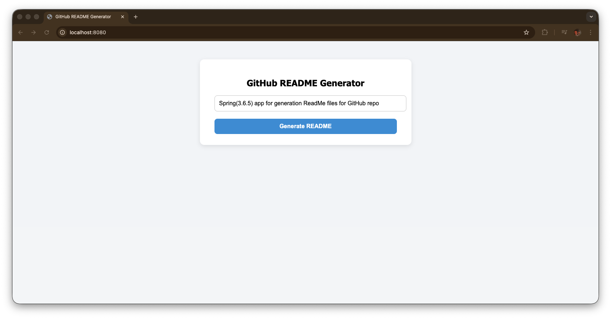
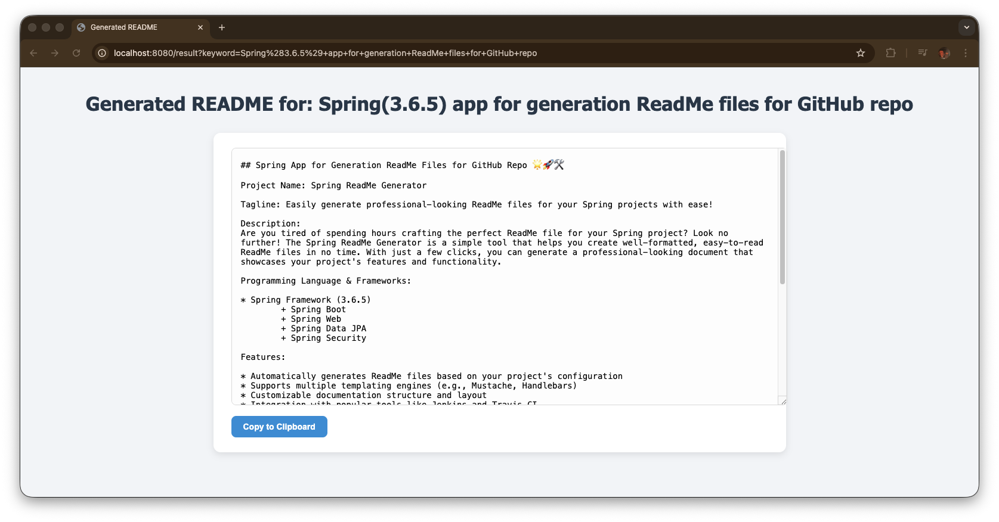
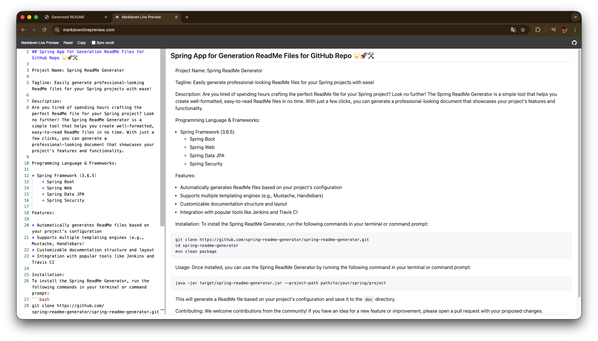

# QuickReadme

**QuickReadme** is a tool for quickly generating README files for your projects. It helps you create structured and informative READMEs using just keywords and basic project information.

## 🚀 Features

- **Generate README from keywords:** Simply enter your project name, description, programming language, and frameworks/libraries, and QuickReadme will create a ready-to-use README.
- **Quick templates:** Save time on documentation and get standardized files for your GitHub projects.
- **Easy customization:** Edit the generated text to fit your needs.
- **Supports multiple programming languages:** Easily adapt to any tech stack.

## ⚡ Example Usage






## 📦 Installation
```
https://github.com/OleksandrRym/QuickReadme.git
ollama pull ollama2:7b
ollama run llama2:7b  
im the program -> run main class
